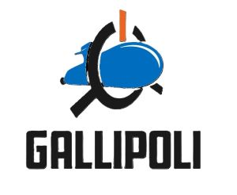

# Teknofest 2024 Autonomous Underwater Vehicle (AUV) Project

Bu depo, Teknofest 2024 İnsansız Su Altı Aracı (AUV) yarışması için geliştirdiğimiz projeye ait kodları ve modelleri içermektedir. Projemiz, su altı keşif ve görevleri için otonom bir araç geliştirmeyi amaçlamaktadır. 

## Klasör Yapısı

- **YOLO_Object_Detection_with_Custom_Circle_Figure**  
  YOLOv8n kullanılarak eğitilmiş özel daire figürü ile nesne tespit modelini içerir. Model, gerçek zamanlı nesne tespiti için optimize edilmiştir.

- **YOLOv8_Model_Training_with_Ultralytics**  
  YOLOv8n modelinin eğitim sürecine ait kodları ve verileri içerir. Modelin nasıl eğitildiğini ve kullanılan veri setlerini bu klasörde bulabilirsiniz.

- **Object_Detection_with_TensorFlow_Lite _(Android-Figure-and-TPU-Support)**  
  TensorFlow Lite kullanılarak eğitilmiş modeldir. Android figürü ve TPU desteği için optimize edilmiştir.

- **Object_Detection_with_TensorFlow_and_OpenCV**  
  TensorFlow ve OpenCV kullanılarak eğitilmiş nesne tespit modelini içerir.

- **Servo_Motor_and_Ultrasonic_Distance_Sensor_Project**  
  Servo motor ve ultrasonik mesafe sensörlerini kullanarak geliştirilmiş bir proje kodları içerir.

- **Arduino-Based_Object_Tracking_System**  
  Arduino ile nesne takibi sağlamak için geliştirilmiş sistem kodlarını içerir.

## Katkıda Bulunma

Projeye katkıda bulunmak isterseniz, lütfen bir fork oluşturun, değişikliklerinizi yapın ve ardından bir pull request gönderin. Her türlü katkı ve geri bildirim değerlidir. Detaylar için `CONTRIBUTING.md` dosyasına bakabilirsiniz.

## Lisans

Bu proje MIT Lisansı ile lisanslanmıştır. Detaylı bilgi için `LICENSE` dosyasına bakınız.

## İletişim

Herhangi bir soru veya geri bildirim için lütfen uzayk204@gmail.com adresinden bizimle iletişime geçin.
